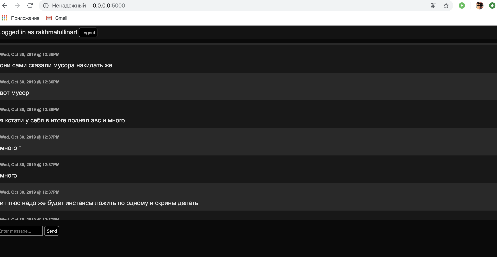
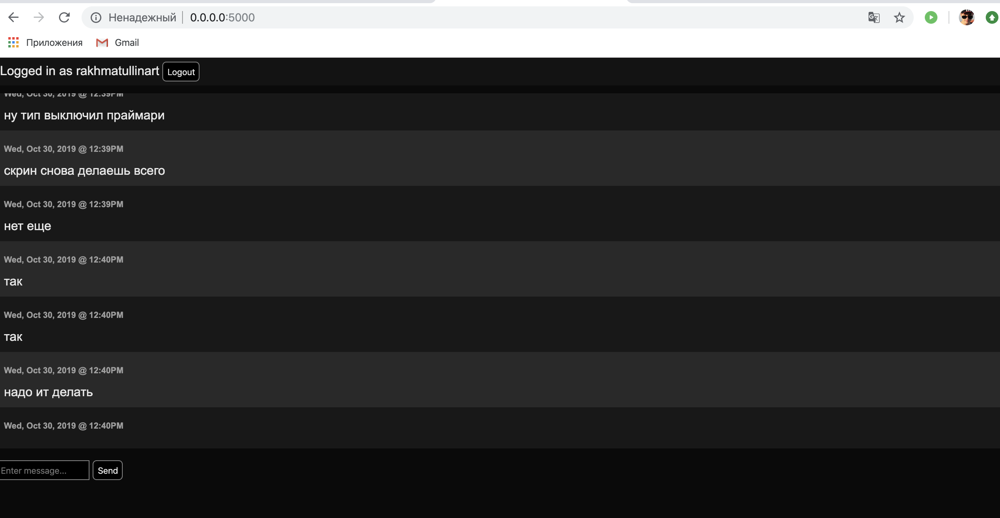

### rs.config()

```json
{
	"_id" : "rs0",
	"version" : 7,
	"protocolVersion" : NumberLong(1),
	"members" : [
		{
			"_id" : 0,
			"host" : "mongo0.com:27017",
			"arbiterOnly" : false,
			"buildIndexes" : true,
			"hidden" : false,
			"priority" : 1,
			"tags" : {

			},
			"slaveDelay" : NumberLong(0),
			"votes" : 1
		},
		{
			"_id" : 1,
			"host" : "mongo1.com:27017",
			"arbiterOnly" : false,
			"buildIndexes" : true,
			"hidden" : false,
			"priority" : 1,
			"tags" : {

			},
			"slaveDelay" : NumberLong(0),
			"votes" : 1
		},
		{
			"_id" : 2,
			"host" : "mongo2.com:27017",
			"arbiterOnly" : false,
			"buildIndexes" : true,
			"hidden" : false,
			"priority" : 1,
			"tags" : {

			},
			"slaveDelay" : NumberLong(0),
			"votes" : 1
		}
	],
	"settings" : {
		"chainingAllowed" : true,
		"heartbeatIntervalMillis" : 2000,
		"heartbeatTimeoutSecs" : 10,
		"electionTimeoutMillis" : 10000,
		"getLastErrorModes" : {

		},
		"getLastErrorDefaults" : {
			"w" : 1,
			"wtimeout" : 0
		},
		"replicaSetId" : ObjectId("5db93eaaf6554730827e301f")
	}
}
```
### rs.status
```json
{
	"set" : "rs0",
	"date" : ISODate("2019-11-01T06:34:57.430Z"),
	"myState" : 1,
	"term" : NumberLong(1),
	"heartbeatIntervalMillis" : NumberLong(2000),
	"members" : [
		{
			"_id" : 0,
			"name" : "mongo0.com:27017",
			"health" : 1,
			"state" : 1,
			"stateStr" : "PRIMARY",
			"uptime" : 168819,
			"optime" : {
				"ts" : Timestamp(1572590084, 1),
				"t" : NumberLong(1)
			},
			"optimeDate" : ISODate("2019-11-01T06:34:44Z"),
			"electionTime" : Timestamp(1572421290, 2),
			"electionDate" : ISODate("2019-10-30T07:41:30Z"),
			"configVersion" : 7,
			"self" : true
		},
		{
			"_id" : 1,
			"name" : "mongo1.com:27017",
			"health" : 1,
			"state" : 2,
			"stateStr" : "SECONDARY",
			"uptime" : 13,
			"optime" : {
				"ts" : Timestamp(1572590084, 1),
				"t" : NumberLong(1)
			},
			"optimeDate" : ISODate("2019-11-01T06:34:44Z"),
			"lastHeartbeat" : ISODate("2019-11-01T06:34:56.139Z"),
			"lastHeartbeatRecv" : ISODate("2019-11-01T06:34:56.138Z"),
			"pingMs" : NumberLong(0),
			"configVersion" : 7
		},
		{
			"_id" : 2,
			"name" : "mongo2.com:27017",
			"health" : 1,
			"state" : 2,
			"stateStr" : "SECONDARY",
			"uptime" : 13,
			"optime" : {
				"ts" : Timestamp(1572590084, 1),
				"t" : NumberLong(1)
			},
			"optimeDate" : ISODate("2019-11-01T06:34:44Z"),
			"lastHeartbeat" : ISODate("2019-11-01T06:34:56.147Z"),
			"lastHeartbeatRecv" : ISODate("2019-11-01T06:34:56.137Z"),
			"pingMs" : NumberLong(0),
			"configVersion" : 7
		}
	],
	"ok" : 1
}
```
### Recent messages in chat app


### rs.config() shutting down primary node
```json
{
	"_id" : "rs0",
	"version" : 7,
	"protocolVersion" : NumberLong(1),
	"members" : [
		{
			"_id" : 0,
			"host" : "mongo0.com:27017",
			"arbiterOnly" : false,
			"buildIndexes" : true,
			"hidden" : false,
			"priority" : 1,
			"tags" : {

			},
			"slaveDelay" : NumberLong(0),
			"votes" : 1
		},
		{
			"_id" : 1,
			"host" : "mongo1.com:27017",
			"arbiterOnly" : false,
			"buildIndexes" : true,
			"hidden" : false,
			"priority" : 1,
			"tags" : {

			},
			"slaveDelay" : NumberLong(0),
			"votes" : 1
		},
		{
			"_id" : 2,
			"host" : "mongo2.com:27017",
			"arbiterOnly" : false,
			"buildIndexes" : true,
			"hidden" : false,
			"priority" : 1,
			"tags" : {

			},
			"slaveDelay" : NumberLong(0),
			"votes" : 1
		}
	],
	"settings" : {
		"chainingAllowed" : true,
		"heartbeatIntervalMillis" : 2000,
		"heartbeatTimeoutSecs" : 10,
		"electionTimeoutMillis" : 10000,
		"getLastErrorModes" : {

		},
		"getLastErrorDefaults" : {
			"w" : 1,
			"wtimeout" : 0
		},
		"replicaSetId" : ObjectId("5db93eaaf6554730827e301f")
	}
}
```
### rs.status after shutting down primary node
```json
{
	"set" : "rs0",
	"date" : ISODate("2019-11-01T07:18:24.817Z"),
	"myState" : 1,
	"term" : NumberLong(6),
	"heartbeatIntervalMillis" : NumberLong(2000),
	"members" : [
		{
			"_id" : 0,
			"name" : "mongo0.com:27017",
			"health" : 0,
			"state" : 8,
			"stateStr" : "(not reachable/healthy)",
			"uptime" : 0,
			"optime" : {
				"ts" : Timestamp(0, 0),
				"t" : NumberLong(-1)
			},
			"optimeDate" : ISODate("1970-01-01T00:00:00Z"),
			"lastHeartbeat" : ISODate("2019-11-01T07:18:23.985Z"),
			"lastHeartbeatRecv" : ISODate("2019-11-01T07:16:41.881Z"),
			"pingMs" : NumberLong(0),
			"lastHeartbeatMessage" : "Connection refused",
			"configVersion" : -1
		},
		{
			"_id" : 1,
			"name" : "mongo1.com:27017",
			"health" : 1,
			"state" : 2,
			"stateStr" : "SECONDARY",
			"uptime" : 181,
			"optime" : {
				"ts" : Timestamp(1572592612, 1),
				"t" : NumberLong(6)
			},
			"optimeDate" : ISODate("2019-11-01T07:16:52Z"),
			"lastHeartbeat" : ISODate("2019-11-01T07:18:23.942Z"),
			"lastHeartbeatRecv" : ISODate("2019-11-01T07:18:22.893Z"),
			"pingMs" : NumberLong(0),
			"syncingTo" : "mongo2.com:27017",
			"configVersion" : 7
		},
		{
			"_id" : 2,
			"name" : "mongo2.com:27017",
			"health" : 1,
			"state" : 1,
			"stateStr" : "PRIMARY",
			"uptime" : 182,
			"optime" : {
				"ts" : Timestamp(1572592612, 1),
				"t" : NumberLong(6)
			},
			"optimeDate" : ISODate("2019-11-01T07:16:52Z"),
			"infoMessage" : "could not find member to sync from",
			"electionTime" : Timestamp(1572592611, 1),
			"electionDate" : ISODate("2019-11-01T07:16:51Z"),
			"configVersion" : 7,
			"self" : true
		}
	],
	"ok" : 1
}
```
### Recent messages in chat app after shutting down primary node
